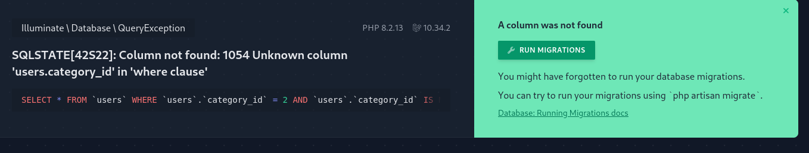

order of migrations files is important

```bash
❯ php artisan migrate:rollback --path=database/migrations/2023_11_29_204440_create_posts_table.php
❯ php artisan migrate --path=database/migrations/2023_11_29_204440_create_posts_table.php
```

---

```php

// CategoryModel.php
// TEST - A category has many posts
public function users(): HasMany
{
    return $this->hasMany(User::class);
}

// CategoryController.php
dd(Category::find($id)->users);
```


